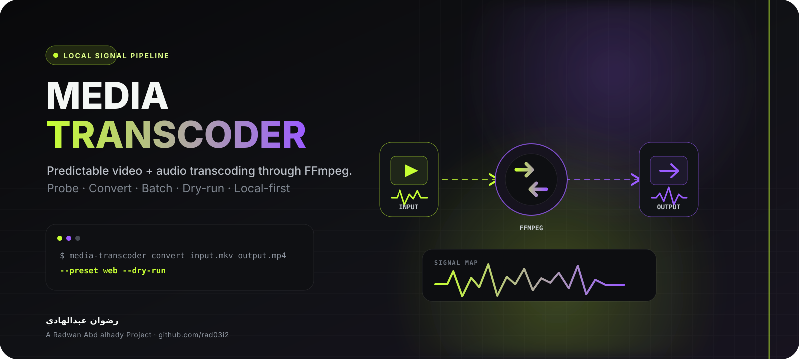

<div align="center">



<br/>


# Media Transcoder

**A predictable, local-first FFmpeg workflow for video and audio.**

<div dir="rtl">
<strong>أداة سطر أوامر محلية تجعل تحويل الفيديو والصوت عبر FFmpeg أوضح، أكثر أمانًا، وأسهل للتكرار.</strong>
</div>

<br/>

[](https://github.com/rad03i2/media-transcoder/actions/workflows/ci.yml)


**[العربية](README_AR.md) · [English](README_EN.md) · [Architecture](docs/ARCHITECTURE.md) · [Brand](docs/BRAND.md) · [Security](SECURITY.md)**

</div>

---

## A small control layer for a powerful media engine

Media Transcoder wraps an installed **FFmpeg / FFprobe** toolchain with a focused Python CLI for repeatable everyday jobs. It does not hide FFmpeg behind a cloud service or a proprietary format: it builds explicit commands, validates paths, protects existing output, and keeps processing on the local machine.

<table>
<tr>
<td width="25%"><strong>Convert</strong><br/><sub>Transcode a single video or audio file through named presets.</sub></td>
<td width="25%"><strong>Inspect</strong><br/><sub>Read container, stream, and codec metadata through FFprobe JSON.</sub></td>
<td width="25%"><strong>Batch</strong><br/><sub>Process supported files while preserving relative directory structure.</sub></td>
<td width="25%"><strong>Preview</strong><br/><sub>Use dry-run mode to inspect the exact FFmpeg command before writing output.</sub></td>
</tr>
</table>

## Signal path

```text
source media
    │
    ▼
path + preset validation
    │
    ├── dry-run ───────► print FFmpeg command
    │
    ▼
temporary sibling output
    │
    ▼
FFmpeg process
    │
    ├── failure ───────► remove temporary output
    │
    ▼
validate non-empty result
    │
    ▼
replace final destination
```

The temporary output is created beside the destination and promoted only after FFmpeg succeeds. Existing output is protected unless `--overwrite` is explicitly requested.

## Presets available now

| Preset | Current behavior |
|---|---|
| `web` | H.264 video + AAC audio, CRF 23, medium preset, MP4 fast-start flag |
| `small` | H.265 video + AAC audio, CRF 28, medium preset |
| `audio-mp3` | Audio-only MP3 using `libmp3lame` |
| `audio-opus` | Audio-only Opus using `libopus` at 128 kb/s |
| `copy` | Stream copy / remux without re-encoding when the container is compatible |

These are intentionally practical presets rather than a replacement for FFmpeg's complete option surface.

## 30-second start

> **Requirements:** Python 3.10+ plus `ffmpeg` and `ffprobe` available on `PATH`.

```bash
git clone https://github.com/rad03i2/media-transcoder.git
cd media-transcoder
python -m venv .venv
# Windows: .venv\Scripts\activate
# Linux/macOS: source .venv/bin/activate
python -m pip install -e .
```

Verify the external tools:

```bash
ffmpeg -version
ffprobe -version
```

## CLI recipes

Inspect a media file:

```bash
media-transcoder probe movie.mkv
```

Preview a conversion without creating output:

```bash
media-transcoder convert movie.mkv movie.mp4 --preset web --dry-run
```

Convert for common web playback:

```bash
media-transcoder convert movie.mkv movie.mp4 --preset web
```

Extract or transcode audio to MP3:

```bash
media-transcoder convert interview.mkv interview.mp3 --preset audio-mp3
```

Batch-convert a directory recursively:

```bash
media-transcoder batch ./incoming ./converted --preset web --ext .mp4 --recursive
```

Use `--overwrite` only when replacing an existing destination is intentional.

## Batch discovery

The batch scanner currently discovers:

`MP4` · `MKV` · `MOV` · `AVI` · `WebM` · `M4V` · `MP3` · `WAV` · `FLAC` · `M4A` · `OGG` · `Opus`

FFmpeg itself can support additional formats for individual conversions; the batch scanner intentionally uses a conservative allow-list.

## Local-first safety model

- Media is processed through locally installed FFmpeg / FFprobe.
- The project makes no network calls and requires no account, token, or API key.
- Input and output paths cannot be the same.
- Existing destinations are rejected unless `--overwrite` is present.
- Commands are passed to `subprocess` as argument arrays rather than shell strings.
- Failed jobs clean up the temporary output created by that attempt.

For untrusted media, keep FFmpeg and the operating system updated. See [SECURITY.md](SECURITY.md).

## Tests and CI

```bash
python -m pip install -e . pytest
pytest -q
```

The repository currently tests command construction, overwrite protection, same-path rejection, failed-output preservation, media discovery, dry-run behavior, and empty batch handling.

GitHub Actions runs the test suite on:

| OS | Python |
|---|---|
| Ubuntu | 3.10 · 3.12 · 3.13 |
| Windows | 3.10 · 3.12 · 3.13 |
| macOS | 3.10 · 3.12 · 3.13 |

Core command-building tests mock tool discovery where appropriate, so those tests do not require an FFmpeg installation.

## Project structure

```text
media-transcoder/
├── assets/
│   ├── project-cover.svg
│   └── project-logo.svg
├── docs/
│   ├── ARCHITECTURE.md
│   └── BRAND.md
├── src/media_transcoder/
│   ├── __init__.py
│   ├── cli.py
│   └── core.py
├── tests/
│   ├── test_cli.py
│   └── test_core.py
├── .github/
│   ├── ISSUE_TEMPLATE/
│   ├── PULL_REQUEST_TEMPLATE.md
│   └── workflows/ci.yml
├── README_AR.md
├── README_EN.md
├── CHANGELOG.md
├── CONTRIBUTING.md
├── SECURITY.md
└── LICENSE
```

## Current boundaries

FFmpeg and FFprobe are external dependencies and are not bundled. The project does not currently provide a desktop GUI, GPU-specific presets, a job queue, streaming-service integration, or automatic codec/container compatibility resolution. If FFmpeg rejects a requested combination, its error is surfaced to the user.

## Documentation

| Document | Purpose |
|---|---|
| [README_AR.md](README_AR.md) | Full Arabic guide |
| [README_EN.md](README_EN.md) | Full English guide |
| [docs/ARCHITECTURE.md](docs/ARCHITECTURE.md) | Runtime flow, responsibilities, and safety boundaries |
| [docs/BRAND.md](docs/BRAND.md) | Visual identity and asset usage |
| [CHANGELOG.md](CHANGELOG.md) | Notable release and repository changes |
| [CONTRIBUTING.md](CONTRIBUTING.md) | Contribution workflow |
| [SECURITY.md](SECURITY.md) | Security and private reporting guidance |
| [LICENSE](LICENSE) | MIT License |

---

<div align="center">

### Built by رضوان عبدالهادي

**Radwan Abd alhady Ahmed · [@rad03i2](https://github.com/rad03i2)**

<sub>Local media in. Predictable FFmpeg commands. Local media out.</sub>

</div>
